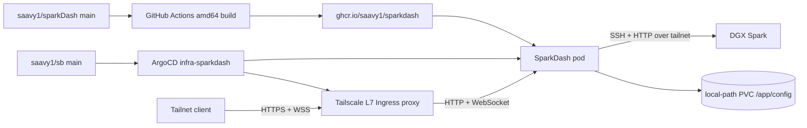

# SparkDash k3s Deployment Design

Date: 2026-08-20
Status: Implemented and verified

## Goal

Deploy the `saavy1/sparkDash` fork to the Superbloom k3s cluster through ArgoCD. Build a reproducible amd64 container image in GitHub Actions, publish it to GHCR, preserve SparkDash runtime state, expose the dashboard only to the Tailscale tailnet, and allow the workload to monitor the DGX Spark over its existing tailnet connection.

## Current State

- Source checkout: `~/dev/sparkdash`
- Upstream: `MiaAI-Lab/sparkdash`
- Fork: `saavy1/sparkDash`
- Cluster configuration: `argocd/clusters/superbloom/`
- Cluster node: `superbloom`, amd64, Tailscale IP `100.66.91.56`, tag `tag:server`
- Spark: `spark.tailc2db57.ts.net`, Tailscale IP `100.115.255.14`
- Tailscale Kubernetes Operator: `v1.102.3`
- Existing incomplete scaffold: `argocd/clusters/superbloom/infra/sparkdash/`

A temporary pod proved that cluster DNS resolves `spark.tailc2db57.ts.net` and that the pod can connect to TCP/22 at both the MagicDNS name and Tailscale IP. This means a Tailscale egress proxy is not required for basic Spark connectivity.

SparkDash has no HTTP authentication and includes shutdown and Wake-on-LAN APIs. It must not be exposed through public Cloudflare DNS or Caddy without an authentication layer. Authelia and Hermes are no longer deployed on this cluster.

## Architecture

### Image pipeline

The local SparkDash checkout will use:

- `origin`: `git@github.com:saavy1/sparkDash.git`
- `upstream`: `git@github.com:MiaAI-Lab/sparkdash.git`

A workflow in `.github/workflows/container.yml` will:

- run on pushes to `main` and manual dispatch;
- grant only `contents: read` and `packages: write`;
- build the existing `Dockerfile` for `linux/amd64`;
- publish `ghcr.io/saavy1/sparkdash`;
- publish `latest` only from the default branch;
- publish an immutable tag containing the `sha-` prefix and the source commit's short SHA;
- use GitHub Actions build cache.

Changes will go through a feature branch and pull request. The ArgoCD deployment will use the immutable SHA tag, not `latest`. The GHCR package must be public because the cluster does not use an image pull secret for public `ghcr.io/saavy1/*` images.

### ArgoCD application

`argocd/clusters/superbloom/infra/sparkdash/app.yaml` will define `infra-sparkdash` in the `argocd` namespace using a multi-source ArgoCD application:

1. bjw-s `app-template` Helm chart pinned to `4.5.0`;
2. the `saavy1/sb` repository as the Helm values source;
3. `argocd/clusters/superbloom/infra/sparkdash/resources` for the Namespace and Tailscale Ingress.

ArgoCD will target the `sparkdash` namespace with namespace creation enabled, self-healing enabled, pruning disabled, and server-side apply/diff enabled.

The application directory will be registered in `argocd/clusters/superbloom/infra/kustomization.yaml`.

### Runtime workload

The app-template values will create:

- one Deployment replica with `Recreate` strategy;
- image `ghcr.io/saavy1/sparkdash` pinned to the workflow's immutable SHA tag;
- a ClusterIP Service on port `5555`;
- a `1Gi`, `ReadWriteOnce`, `local-path` PVC mounted at `/app/config`;
- startup, readiness, and liveness probes against `GET /api/settings`;
- resource request: `100m` CPU and `128Mi` memory;
- resource limit: `500m` CPU and `512Mi` memory.

Environment:

- `BIND_HOST=0.0.0.0`
- `PORT=5555`
- `LLM_PORT=8888`
- `NODE_ENV=production`

The deployment will not use host networking, host PID, privileged mode, host `/proc` or `/sys` mounts, NVIDIA mounts, or an SSH private key. Those Compose settings are for monitoring the container host as a local Spark; this deployment monitors the DGX remotely.

The current image runs as root and SparkDash expects a writable `/root/.ssh/known_hosts` because it uses `StrictHostKeyChecking=accept-new`. The first deployment will retain the image user while setting `allowPrivilegeEscalation: false` and dropping all Linux capabilities. Moving to a non-root runtime user is out of scope because it requires an upstream image change and writable-home design.

### Persistent state

The `/app/config` PVC preserves:

- `sparks.json`;
- encrypted SSH password state, if ever used;
- SparkDash's generated secrets key;
- settings and daily LLM history.

The PVC uses `local-path`, matching the single-node cluster convention. `Recreate` prevents overlapping pods from contending for the ReadWriteOnce volume during rollout.

### Tailnet-only ingress

A raw Kubernetes `Ingress` will use:

- `ingressClassName: tailscale`;
- TLS hostname `sparkdash`;
- backend Service `sparkdash` on port `5555`;
- path `/` with `Prefix` matching.

The operator will provision a standalone L7 ingress proxy and a valid certificate. The resulting URL will be:

`https://sparkdash.tailc2db57.ts.net`

The shorter `spark` MagicDNS name cannot be used because it already belongs to the DGX Spark. No Tailscale Funnel configuration will be added, so the ingress remains tailnet-only. No Caddy route or Cloudflare DDNS record will be added.

SparkDash uses `/ws`; Tailscale Serve's HTTP reverse proxy supports HTTP upgrade handling. The final smoke test will explicitly verify the WebSocket connection, not only the HTML response.

### Cluster-to-Spark connectivity

SparkDash will connect directly to `spark.tailc2db57.ts.net`. The design deliberately does not add an egress ProxyGroup because:

- direct MagicDNS resolution and TCP/22 connectivity already work from a pod;
- SparkDash supports dynamically added devices;
- SparkDash probes configurable SSH, LLM, and ComfyUI ports;
- Tailscale egress Services require each destination and port to be declared statically.

SparkDash invokes plain OpenSSH with `BatchMode=yes`. No private key is needed only if the tailnet SSH policy permits the `superbloom` node identity to authenticate to the chosen Spark user without an interactive check. The built-in SparkDash connection test will verify this after deployment. If authentication fails, the first fix is the Tailscale SSH ACL. A dedicated egress ProxyGroup is a fallback only if policy requires a separate Kubernetes identity.

## Security Boundaries

- Tailnet membership and ACLs are the dashboard's access-control boundary.
- The dashboard is not exposed through Caddy, Cloudflare, or Funnel.
- The image is public but contains no credentials or runtime state.
- Runtime state stays in the cluster PVC.
- The pod receives no private key or application secret through Git.
- Linux capabilities are dropped and privilege escalation is disabled.
- The app remains root inside the container only for compatibility with the current image's writable-home behavior.

## Failure Handling

- **Image pull fails:** verify the package is public and the immutable tag exists; do not add registry credentials unless public visibility is impossible.
- **Ingress has no address:** inspect the Tailscale operator and generated proxy resources; confirm the `tailscale` IngressClass and OAuth permissions.
- **UI loads but live data does not:** inspect `/ws` in the browser and proxy logs.
- **Spark hostname does not resolve:** confirm cluster DNS still forwards the tailnet MagicDNS zone; the temporary pod test established the expected behavior.
- **SSH port connects but authentication fails:** correct the Tailscale SSH ACL or non-interactive policy for the configured user.
- **PVC mount blocks rollout:** keep a single replica and `Recreate` strategy.

## Verification

1. Validate the SparkDash workflow YAML and merge its pull request.
2. Confirm the Actions build succeeds and publishes both `latest` and the commit SHA tag.
3. Make the GHCR package public and anonymously pull the immutable tag.
4. Run the image locally and verify `GET /api/settings` returns HTTP 200.
5. Render the app-template chart with the committed values.
6. Build the SparkDash resources with Kustomize.
7. Validate the resulting Kubernetes objects with server-side dry-run where possible.
8. Merge the `saavy1/sb` pull request and wait for ArgoCD reconciliation.
9. Confirm Deployment, pod, PVC, Service, Ingress, and Tailscale proxy are healthy.
10. Open `https://sparkdash.tailc2db57.ts.net`, verify the dashboard renders, and confirm `/ws` connects.
11. Configure `spark.tailc2db57.ts.net` and run SparkDash's connection test to verify non-interactive Tailscale SSH and remote probes.

## Outcome

- `saavy1/sparkDash` publishes amd64 images to `ghcr.io/saavy1/sparkdash`; workflow run `32446515259` completed with typecheck, 149 tests, build, and push all passing.
- ArgoCD deploys immutable tag `sha-a3ca3bc` (digest `sha256:21e9c72dfb79f5416418747c4c055d973d8444365d59edd2ea22af09eeaea539`).
- `infra-sparkdash` is Synced and Healthy. The pod is Ready with zero restarts, and the `1Gi` `local-path` PVC is Bound.
- The Tailscale operator assigned `sparkdash.tailc2db57.ts.net` (`100.101.26.112`) and serves valid HTTPS without Funnel.
- Browser verification observed a `101 Switching Protocols` handshake for `wss://sparkdash.tailc2db57.ts.net/ws` and received a text frame.
- The Spark is tagged `tag:spark`; the tailnet SSH policy accepts `tag:server` to `tag:spark` as user `saavy`.
- SparkDash's built-in connection test passed SSH and detected `qwen3.8-27b-sglang` on port `8888`.
- Live monitoring reports the Spark online with GPU, CPU, memory, storage, process, and SGLang metrics.
- A forced Deployment restart preserved the registered Spark configuration on the PVC.

## Non-goals

- Reintroducing Authelia.
- Publishing `spark.saavylab.dev` through Cloudflare or Caddy.
- Tailscale Funnel/public internet access.
- Monitoring the k3s node as a local GPU host.
- Creating static egress Services for every Spark probe port.
- Refactoring SparkDash to run as a non-root image user.
- Adding a private SSH key or GHCR image pull secret.
